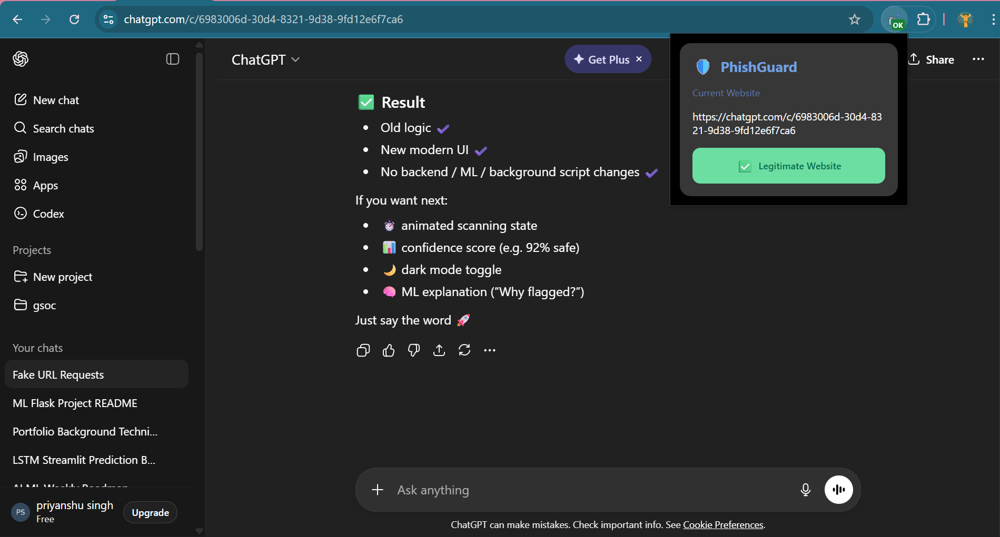
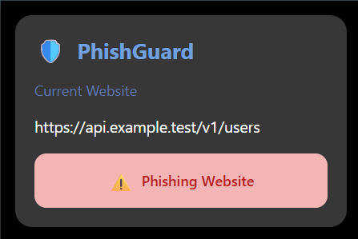
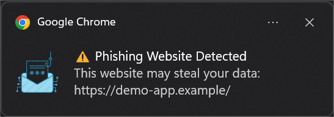

# 🛡️ PhishGuard – ML-Based Phishing URL Detection Chrome Extension

**PhishGuard** is a **machine learning–powered Chrome extension** that detects **phishing websites in real time**.  
When a user enters a suspicious or phishing URL, the system **analyzes the URL using an ML model** and sends an **instant notification** to warn the user.

The backend is built using **FastAPI**, and the phishing detection model is trained using **Scikit-learn**.

---

## 📸 Preview

  


---

## 🚨 Key Highlights

- 🔍 Real-time phishing URL detection  
- 🤖 Machine Learning–based classification  
- 🔔 Instant browser notification on phishing detection  
- 🌐 Chrome extension + FastAPI backend architecture  
- 📊 Experiment tracking using MLflow & DagsHub  

---

## 💡 Features

### 🌐 Chrome Extension
- Monitors the currently visited URL.
- Sends the URL to the backend for analysis.
- Displays **alerts/notifications** when a phishing site is detected.

### 🧠 Machine Learning Model
- Trained using **Scikit-learn** on phishing datasets.
- Extracts features from:
  - URL structure
  - Domain information (WHOIS, DNS)
  - HTML content (using BeautifulSoup)
- Predicts whether a URL is **legitimate or phishing**.

### ⚙️ Backend API
- Built using **FastAPI**.
- Handles prediction requests from the Chrome extension.
- Returns phishing probability/classification in real time.

### 📈 MLOps & Tracking
- Uses **MLflow** for experiment tracking.
- Integrated with **DagsHub** for model versioning.
- Stores metadata and logs using **MongoDB**.

---

## 🧠 How It Works

1. User opens a website in Chrome.
2. Chrome extension captures the URL.
3. URL is sent to the **FastAPI backend**.
4. Backend:
   - Extracts URL & domain features
   - Applies the trained ML model
5. Model predicts **Phishing / Legitimate**.
6. If phishing → **User receives a warning notification**.

---

## 🛠️ Tech Stack

| Category | Technology |
|--------|------------|
| **Frontend** | Chrome Extension (JavaScript, HTML, CSS) |
| **Backend** | FastAPI, Uvicorn |
| **Machine Learning** | Scikit-learn |
| **Data Processing** | Pandas, NumPy |
| **Web Analysis** | Requests, BeautifulSoup |
| **Domain Analysis** | Whois, dnspython |
| **Database** | MongoDB (pymongo) |
| **MLOps** | MLflow, DagsHub |
| **Environment** | python-dotenv |
| **Deployment Ready** | Uvicorn + FastAPI |

---

## ⚙️ Installation & Setup

### 1️⃣ Clone the Repository
```bash
git clone https://github.com/priyan17singh/Network-Security.git

# Navigate to project folder
cd Network-Security

# Create virtual environment
python -m venv venv
source venv/bin/activate      # Linux/Mac
venv\Scripts\activate         # Windows

# Install dependencies
pip install -r requirements.txt

# Run the Streamlit app
streamlit run app.py

#Create a .env file
MONGO_DB_USERNAME=your_mongodb_username
MONGO_DB_PASSWORD=your_mongodb_password
MONGO_DB_HOST=your_mongodb_connection_host

#Run Backend Server
uvicorn main:app --reload


#Load Chrome Extension Locally

- Open Chrome and navigate to chrome://extensions

- Enable Developer Mode

- Click Load unpacked

- Select the chrome-extension/ directory

- Start browsing safely 🚀

```

---

## 📌 Use Cases

- Phishing attack prevention

- Cybersecurity ML projects

- Real-world browser security tools

- AI/ML portfolio showcase

---

## 👨‍💻 Author

**Priyanshu Singh**  
GitHub:  [@priyan17singh](https://github.com/priyan17singh)

---

## ❤️ Support

**If you like this project, don’t forget to give it a ⭐ on GitHub and share a cup of chai ☕ with the creator!**

*“Security begins with awareness — intelligence makes it stronger.”*
